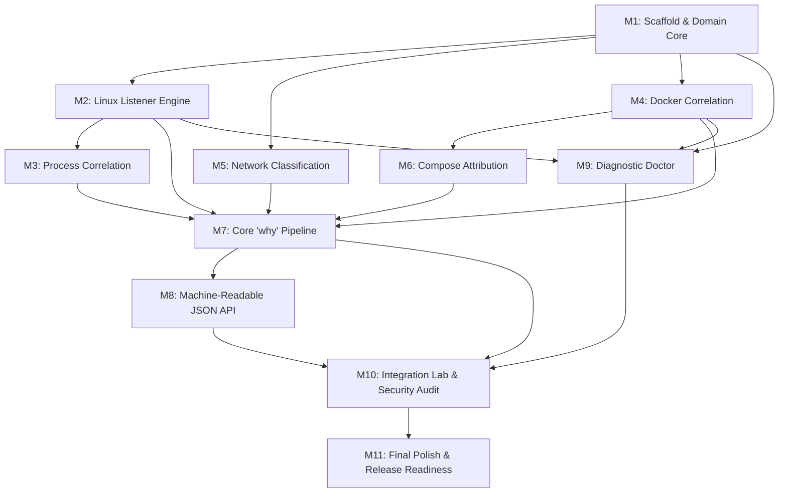

# Lantern v0.1 Implementation Plan

**Product:** Lantern — Local-first developer security CLI  
**Core Purpose:** Explain *why* a network service is reachable on a development machine (`lantern why <port>`)  
**Target Environment:** Linux / WSL2  
**Implementation Language:** Go  
**Specification Reference:** [`PRD.md`](../PRD.md)

---

## 1. Repository Status & Gap Analysis

### Current State
- Repository Root: `<repository-root>`
- Current contents: `PRD.md` only.
- Git repository: Uninitialized (no `.git`).
- Go module: None (`go.mod` does not exist).
- Available toolchain: `Go 1.22+`.

### Gap Analysis (What Exists vs. What Needs to Be Created)

| Component | Status | Required Action |
| :--- | :--- | :--- |
| **Specification** | Exists (`PRD.md`) | Maintain as single source of truth |
| **Go Module** | Missing | Initialize `lantern` (or `github.com/DhyaanKanoja11/Lantern`) via `go mod init` |
| **CLI Entrypoint** | Missing | Create `cmd/lantern/main.go` |
| **CLI Commands** | Missing | Create `internal/cli/` (`root.go`, `scan.go`, `why.go`, `doctor.go`, `version.go`) |
| **Domain Layer** | Missing | Create `internal/domain/` pure data models without external dependencies |
| **Listener Collector** | Missing | Create `internal/collector/` for TCP listener enumeration (`ss` / `/proc/net/tcp`) |
| **Process Correlator**| Missing | Create `internal/process/` for `/proc/<pid>/` inspection |
| **Docker Correlator** | Missing | Create `internal/docker/` for Docker container & published port discovery |
| **Compose Resolver** | Missing | Create `internal/compose/` for Compose YAML AST line attribution |
| **Network Classifier**| Missing | Create `internal/network/` for interface discovery & reachability assessment |
| **Exposure Engine** | Missing | Create `internal/exposure/` to assemble evidence, reachability, & recommendation |
| **Explain / Output** | Missing | Create `internal/explain/` and `internal/output/` for text tree and JSON output |
| **Test Fixtures** | Missing | Create `tests/fixtures/` (Compose files, mock outputs) & `tests/integration/` |
| **Documentation** | Missing | Create `docs/` (`architecture.md`, `detection-model.md`, `threat-model.md`, etc.) |
| **CI / Project Root**| Missing | Create `Makefile`, `LICENSE`, `README.md`, `.gitignore`, `.github/workflows/` |

---

## 2. Technical Ambiguities & Contradictions in PRD.md

1. **Listener Discovery: `ss -lntp` vs. `/proc/net/tcp`**
   - *Issue:* PRD §10 identifies `ss -lntp` as primary, but cautions against relying on human-formatted terminal output and suggests `/proc/net/tcp`. However, `/proc/net/tcp` does *not* include process PIDs; obtaining PIDs from `/proc` requires scanning `/proc/[0-9]*/fd/*` matching socket inodes, which is slow and fails for non-root users on root-owned sockets. `ss` uses the Linux kernel `sock_diag` netlink subsystem to obtain socket-to-process attribution directly.
   - *Resolution:* Implement a primary collector that parses structured `ss -lntp` (or `ss -lntp -H`), and a secondary fallback that parses `/proc/net/tcp` + `/proc/net/tcp6` when `ss` is unavailable (recording PID as unknown if fd access is restricted).

2. **Docker CLI vs. Docker SDK vs. Unix Socket HTTP**
   - *Issue:* PRD §20 advises avoiding dependencies and using the standard library, while PRD §34 specifies using the Docker CLI (`docker ps`, `docker inspect`). CLI execution requires child process spawning and external binary presence. Docker Engine daemon provides a Unix domain socket (`/var/run/docker.sock`) speaking standard HTTP, accessible via Go's standard library `net/http` with zero external dependencies.
   - *Resolution for v0.1:* Follow PRD Prompt 4 strictly by implementing Docker correlation via Docker CLI (`docker inspect` and `docker ps --format '{{json .}}'`) to avoid socket permission complexities in early development, but wrap it cleanly behind a Go `DockerCorrelator` interface so an in-memory mock or direct socket reader can be substituted without changing callers.

3. **Host Process (`docker-proxy`) vs. Containerized Process Name**
   - *Issue:* PRD §7 Command 1 displays:
     `5432  0.0.0.0  docker-proxy  postgres`
     while PRD §32 Prompt 2 displays:
     `5432  0.0.0.0  postgres`
     On Linux with Docker bridge networking, the host OS process holding the listening port is `docker-proxy` (owned by Docker daemon/root), while `postgres` runs in an isolated PID and network namespace inside the container.
   - *Resolution:* Distinguish between `HostProcess` (the process directly bound to the host socket, e.g. `docker-proxy`) and `Container` (the target container name, e.g. `postgres`). In `lantern scan`, show `docker-proxy` under `PROCESS` and the container name under `CONTAINER`. In `lantern why`, show both in the exposure path.

4. **YAML Line Number Tracking**
   - *Issue:* Standard `yaml.Unmarshal` in Go discards line numbers. PRD §14, §18, and §36 mandate exact line attribution (e.g. `docker-compose.yml:18`).
   - *Resolution:* Use `gopkg.in/yaml.v3` `yaml.Node` AST decoding. `yaml.Node.Line` preserves exact 1-indexed line numbers for all mappings and scalar nodes.

5. **Cross-Platform Host Development vs. Linux/WSL Target**
   - *Issue:* Development workstations may run Windows (as currently detected) or macOS, but Lantern's socket and `/proc` logic targets Linux / WSL2. If code relies directly on Linux syscalls without build tags, `go test ./...` and `go build ./...` will fail on non-Linux development machines.
   - *Resolution:* Employ Go file-level build tags (`//go:build linux` for concrete implementations, with stub/mock implementations for non-linux OS) and interface abstractions so the entire test suite passes on both Windows development hosts and Linux/WSL2 targets.

---

## 3. Linux / WSL2 System Interfaces

| Functional Area | Primary Interface | Secondary / Fallback Interface | Notes & Constraints |
| :--- | :--- | :--- | :--- |
| **Listening Sockets** | `ss -lntpH` | `/proc/net/tcp`, `/proc/net/tcp6` | `ss` handles IPv4/IPv6 and extracts PID/comm via netlink `sock_diag`. Address hex in `/proc/net/tcp` requires little-endian decoding. |
| **Process Correlation** | `/proc/<pid>/` (`cmdline`, `comm`, `status`, `exe`) | `ps -p <pid> -o comm=,args=` | Read `/proc/<pid>/cmdline` (split by null byte). Read symlink `/proc/<pid>/exe`. Read UID from `/proc/<pid>/status`. Never read `/proc/<pid>/environ` (prevents secret leaks). Gracefully handle `os.ErrPermission`. |
| **Network Interfaces** | Go stdlib `net.Interfaces()` + `Addrs()` | `ip -j addr` / `/proc/net/dev` | Standard library `net.Interfaces()` discovers interface names, flags (`FlagLoopback`, `FlagUp`), and assigned unicast IPs. Categorize into RFC1918/RFC4193 (LAN), 127.0.0.0/8 (Loopback), or VPN (tun/tap/wg). |
| **Docker Correlation** | `docker inspect <id/name>` & `docker ps --format '{{json .}}'` | `/var/run/docker.sock` HTTP API | Parse `NetworkSettings.Ports` to match `HostPort` and `HostIp`. Inspect labels `com.docker.compose.project.working_dir` and `com.docker.compose.project.config_files`. |
| **Compose Attribution** | Filesystem walk: CWD, parent dirs, Compose labels | Explicit `--project` flag | Look for `docker-compose.yml`, `docker-compose.yaml`, `compose.yml`, `compose.yaml`. Stop ascending at filesystem root or git boundary. Parse via `yaml.Node`. |

---

## 4. Minimum Architecture for v0.1

Lantern adheres to a layered architecture with strict unidirectional dependencies:

```text
       CLI Layer (cmd/lantern, internal/cli)
                        │
                        ▼
      Application / Use Case Layer (internal/exposure, internal/explain)
                        │
                        ▼
            Domain Layer (internal/domain)
                        ▲
                        │ (implements interfaces)
     Infrastructure Layer (internal/collector, internal/process,
                           internal/docker, internal/compose,
                           internal/network, internal/output)
```

### Architectural Guardrails
1. **Domain Independence:** `internal/domain` contains only pure Go structs and value objects. No `exec.Command`, no file I/O, no network calls.
2. **Standard Library Priority (Ponytail Rule):** Use Go standard library for networking, process execution, JSON serialization, and filesystem traversal.
3. **External Dependencies Limited to Two:**
   - `github.com/spf13/cobra` (for robust POSIX CLI flag and subcommand parsing)
   - `gopkg.in/yaml.v3` (for YAML AST parsing with line number metadata)
4. **Resilient Error Degradation:** Subsystem failures (e.g. unprivileged user, Docker daemon stopped, missing Compose file) do not abort execution. Lantern displays all collected evidence and records explicit diagnostic warnings.
5. **No Mutation:** Lantern v0.1 is strictly read-only. It never modifies files, firewall rules, or container states.

---

## 5. Domain Models (`internal/domain`)

```go
package domain

// Listener represents a bound TCP listening socket.
type Listener struct {
	Protocol    string // "tcp", "tcp4", "tcp6"
	Address     string // "0.0.0.0", "127.0.0.1", "::", "192.168.1.50"
	Port        uint16
	PID         int    // 0 if unknown / permission denied
	ProcessName string // "docker-proxy", "node", "sshd", "unknown"
}

// Process details discovered from /proc/<pid>.
type Process struct {
	PID        int
	Name       string
	Executable string
	CommandLine string
	User       string
	ParentPID  int
}

// PortMapping reflects a container port published to the host.
type PortMapping struct {
	HostIP        string
	HostPort      uint16
	ContainerPort uint16
	Protocol      string
}

// Container details for a correlated Docker workload.
type Container struct {
	ID         string
	Name       string
	Image      string
	Ports      []PortMapping
	Labels     map[string]string
	Networks   []string
}

// NetworkInterface represents a local host network adapter.
type NetworkInterface struct {
	Name      string
	IP        string
	CIDR      string
	Kind      string // "LOOPBACK", "LAN", "VPN", "OTHER"
	IsLoopback bool
}

// ConfigEvidence pinpoints the configuration line responsible for exposure.
type ConfigEvidence struct {
	File     string
	Line     int
	Evidence string // e.g. "5432:5432"
	Kind     string // "compose", "docker-run", "unknown"
	Certain  bool   // true = ROOT CAUSE, false = LIKELY SOURCE
}

// Reachability classifies service exposure.
type Reachability struct {
	Local    bool   // true
	LAN      string // "no", "possible", "yes"
	Internet string // "unknown" (never claim true without explicit external proof)
}

// Recommendation provides deterministic, non-destructive remediation guidance.
type Recommendation struct {
	Type        string // "bind_localhost", "remove_published_port"
	Current     string // "0.0.0.0:5432"
	Suggested   string // "127.0.0.1:5432:5432"
	Description string
}

// Exposure is the aggregate root explaining why a port is reachable.
type Exposure struct {
	Port           uint16
	Protocol       string
	Listener       Listener
	Process        *Process
	Container      *Container
	DockerMapping  *PortMapping
	Config         *ConfigEvidence
	Interfaces     []NetworkInterface
	Reachability   Reachability
	Recommendation *Recommendation
	Warnings       []string
}

// ExposureSummary represents a single line in `lantern scan`.
type ExposureSummary struct {
	Port          uint16
	Address       string
	Protocol      string
	ProcessName   string
	PID           int
	ContainerName string
}
```

---

## 6. Package Contracts & Interfaces

### 1. Collector (`internal/collector`)
```go
package collector

import (
	"context"
	"lantern/internal/domain"
)

type ListenerCollector interface {
	CollectListeners(ctx context.Context) ([]domain.Listener, error)
	FindListenerByPort(ctx context.Context, port uint16) (*domain.Listener, error)
}
```

### 2. Process Correlator (`internal/process`)
```go
package process

import (
	"context"
	"lantern/internal/domain"
)

type ProcessCorrelator interface {
	Correlate(ctx context.Context, pid int) (*domain.Process, error)
}
```

### 3. Docker Correlator (`internal/docker`)
```go
package docker

import (
	"context"
	"lantern/internal/domain"
)

type DockerCorrelator interface {
	IsAvailable(ctx context.Context) bool
	CorrelatePort(ctx context.Context, port uint16) (*domain.Container, *domain.PortMapping, error)
	ListContainers(ctx context.Context) ([]domain.Container, error)
}
```

### 4. Network Classifier (`internal/network`)
```go
package network

import (
	"context"
	"lantern/internal/domain"
)

type InterfaceClassifier interface {
	DiscoverInterfaces(ctx context.Context) ([]domain.NetworkInterface, error)
	ClassifyReachability(bindAddr string, ifaces []domain.NetworkInterface) domain.Reachability
}
```

### 5. Compose Resolver (`internal/compose`)
```go
package compose

import (
	"context"
	"lantern/internal/domain"
)

type ComposeResolver interface {
	ResolveAttribution(ctx context.Context, container *domain.Container, hostPort uint16) (*domain.ConfigEvidence, error)
}
```

### 6. Exposure Analyzer (`internal/exposure`)
```go
package exposure

import (
	"context"
	"lantern/internal/domain"
)

type Analyzer interface {
	Why(ctx context.Context, port uint16, projectDir string) (*domain.Exposure, error)
	Scan(ctx context.Context) ([]domain.ExposureSummary, error)
}
```

### 7. Output Formatter (`internal/output`)
```go
package output

import (
	"io"
	"lantern/internal/domain"
)

type Formatter interface {
	RenderWhy(w io.Writer, exp *domain.Exposure) error
	RenderScan(w io.Writer, list []domain.ExposureSummary) error
}
```

---

## 7. Implementation Milestones



### Milestone 1: Project Scaffolding & Domain Core
- **Objective:** Establish Go module, directory hierarchy, domain structures, and stub CLI.
- **Tasks:**
  1. Initialize `go.mod` (`go mod init lantern` or `github.com/DhyaanKanoja11/Lantern`).
  2. Create full directory structure matching PRD §21.
  3. Implement domain models in `internal/domain/`.
  4. Scaffold Cobra CLI in `internal/cli/` (`root`, `version`, `doctor`, `scan`, `why`).
  5. Implement `lantern version` (outputs `lantern v0.1.0`).
- **Verification:** `go build ./...` and `go test ./...` succeed without errors.

### Milestone 2: Linux Listener Engine
- **Objective:** Enumerate active TCP listening sockets on Linux/WSL.
- **Tasks:**
  1. Implement `internal/collector/` with `ListenerCollector` interface.
  2. Implement `linux_listener.go` parsing `ss -lntpH` with structured column extraction.
  3. Implement fallback parser for `/proc/net/tcp` and `/proc/net/tcp6`.
  4. Address normalization (`0.0.0.0`, `127.0.0.1`, `[::]`, `::1`).
  5. Wire into `lantern scan` placeholder to show port, address, and preliminary process.
- **Verification:** Unit tests with mock `ss` outputs and `/proc/net/tcp` sample files.

### Milestone 3: Process Correlation
- **Objective:** Correlate socket PIDs with executable, command line, and user metadata.
- **Tasks:**
  1. Implement `internal/process/` reading `/proc/<pid>/comm`, `/proc/<pid>/cmdline`, and `/proc/<pid>/status`.
  2. Prevent secret leakage by ignoring `/proc/<pid>/environ`.
  3. Gracefully handle permission denials (unprivileged user inspecting root daemon).
  4. Update `lantern scan` to populate `PROCESS` column accurately.
- **Verification:** Unit tests with mock `/proc` directory structures (normal process, missing process, permission denied).

### Milestone 4: Docker Correlation
- **Objective:** Map host listening ports to running Docker containers and port bindings.
- **Tasks:**
  1. Implement `internal/docker/` checking Docker CLI and daemon availability.
  2. Parse `docker ps --format '{{json .}}'` and `docker inspect <id>`.
  3. Correlate `HostPort` to container metadata (ID, Name, Image, Published Ports).
  4. Update `lantern scan` to show `CONTAINER` column (`postgres`, `redis`, etc.).
  5. Fall back cleanly with diagnostic warning if Docker is stopped or uninstalled.
- **Verification:** Unit tests with mock `docker inspect` JSON fixtures.

### Milestone 5: Network Interface Classification & Reachability
- **Objective:** Discover network adapters and compute reachability classification.
- **Tasks:**
  1. Implement `internal/network/` using Go stdlib `net.Interfaces()`.
  2. Classify IP ranges: `LOOPBACK` (`127.0.0.0/8`, `::1`), `LAN` (RFC1918, RFC4193), `VPN`, `OTHER`.
  3. Compute reachability matrix:
     - `127.0.0.1` / `::1` -> Local: `true`, LAN: `no`, Internet: `unknown`
     - `0.0.0.0` / `::` -> Local: `true`, LAN: `possible`, Internet: `unknown`
     - Specific LAN IP -> Local: `true`, LAN: `possible`, Internet: `unknown`
- **Verification:** Table-driven unit tests for IPv4 and IPv6 subnet classifications.

### Milestone 6: Docker Compose Attribution
- **Objective:** Locate Compose files and identify the exact YAML configuration line responsible for port exposure.
- **Tasks:**
  1. Implement `internal/compose/` searching CWD, parent dirs, and container labels (`com.docker.compose.project.working_dir`, `com.docker.compose.project.config_files`).
  2. Support filenames: `docker-compose.yml`, `docker-compose.yaml`, `compose.yml`, `compose.yaml`.
  3. Parse YAML AST using `gopkg.in/yaml.v3` `yaml.Node` to locate the `ports:` item and record exact 1-indexed line number.
  4. Distinguish between verified certainty (`ROOT CAUSE`) and heuristic inference (`LIKELY SOURCE`).
- **Verification:** Unit tests across fixture Compose files (`tests/fixtures/compose-*`).

### Milestone 7: The Core `lantern why <port>` Engine
- **Objective:** Unify all layers into the signature developer command.
- **Tasks:**
  1. Implement `internal/exposure/analyzer.go` linking Port -> Listener -> Process -> Docker -> Interface -> Compose -> Reachability -> Recommendation.
  2. Implement `internal/exposure/recommendation.go` (e.g. converting `5432:5432` to `127.0.0.1:5432:5432`).
  3. Implement `internal/explain/` generating the ASCII exposure tree.
  4. Implement `internal/output/text.go` rendering `SERVICE`, `EXPOSURE PATH`, `ROOT CAUSE`, `REACHABILITY`, `RECOMMENDED CHANGE`.
- **Verification:** Unit and end-to-end pipeline tests verifying complete exposure chains.

### Milestone 8: Machine-Readable JSON API
- **Objective:** Support `--json` flag on `lantern scan` and `lantern why`.
- **Tasks:**
  1. Define JSON serializable structs matching PRD §18 exactly.
  2. Implement `internal/output/json.go`.
  3. Enforce rule: No logging or human text on stdout when `--json` is active (warnings in JSON or stderr).
  4. Generate and document JSON schema in `docs/json-schema.json`.
- **Verification:** Golden file tests comparing JSON output against expected fixtures.

### Milestone 9: Diagnostic Doctor (`lantern doctor`)
- **Objective:** Verify host prerequisites and report operational permissions.
- **Tasks:**
  1. Implement checks in `internal/cli/doctor.go`:
     - Operating system (Linux/WSL detection via `/proc/version` or `runtime.GOOS`).
     - Availability of `ss` utility.
     - Docker CLI availability & daemon connectivity.
     - `/proc` read permissions for process correlation.
     - Network interface enumeration capability.
  2. Format output with `✓`, `⚠`, and `✗` markers.
- **Verification:** Unit tests exercising doctor check evaluators.

### Milestone 10: Integration Test Lab & Security Audit
- **Objective:** Verify end-to-end behavior and conduct thorough security hardening.
- **Tasks:**
  1. Create test suites in `tests/integration/` with build tag `//go:build integration`.
  2. Security audit:
     - Verify zero command injection or shell interpolation in `exec.Command`.
     - Verify path traversal prevention when inspecting Compose paths from container labels.
     - Confirm absence of environment variable leakage from `/proc/<pid>/environ`.
     - Confirm read-only operation (zero file/firewall mutation).
- **Verification:** `go test -tags=integration ./...` and static security checks.

### Milestone 11: Final Polish & Release Readiness
- **Objective:** Prepare repository for public open-source release.
- **Tasks:**
  1. Write high-impact `README.md` featuring value proposition, ASCII demo, quick start, and security notice.
  2. Create `LICENSE` (MIT).
  3. Create `Makefile` (`build`, `test`, `lint`, `vet`).
  4. Create GitHub Actions workflows (`.github/workflows/test.yml`, `release.yml`).
  5. Validate against PRD §28 Acceptance Criteria checklist.
- **Verification:** Clean pass on `go test ./...`, `go vet ./...`, and `go build ./...`.

---

## 8. Testing Strategy

### 1. Unit Tests
- **Listener Parsing:** Test `ss` output and `/proc/net/tcp` entries with little-endian hex addresses, dual-stack IPv6 (`::ffff:0.0.0.0`), and IPv4.
- **Process Inspection:** Test mock `/proc` data, handling truncated command lines, missing PIDs, and permission errors.
- **Docker JSON Parsing:** Test `docker inspect` outputs with multiple port bindings, host-bound ports, wildcard ports, and containers without published ports.
- **YAML AST Attribution:** Test various Compose syntaxes (short syntax `5432:5432`, host-bound `127.0.0.1:5432:5432`, long syntax with `target`/`published`), verifying exact line numbers.
- **Reachability & Recommendation:** Test deterministic outputs across loopback, RFC1918 LAN, and wildcard IPs.

### 2. Golden File Tests
- Record expected JSON outputs for `lantern scan --json` and `lantern why <port> --json`.
- Compare output byte-for-byte (normalizing timestamps/PIDs if needed) to prevent schema regressions.

### 3. Integration Tests (Opt-In)
- Guard live system tests behind `//go:build integration`.
- Standard `go test ./...` runs in milliseconds without requiring Docker or root privileges.
- Integration tests spin up fixture containers (e.g. `postgres` or `nginx` with known port bindings) and verify the complete resolution chain.

---

## 9. File Manifest

### Files to Create
```text
cmd/
  lantern/
    main.go
internal/
  cli/
    root.go
    scan.go
    why.go
    doctor.go
    version.go
  domain/
    listener.go
    process.go
    container.go
    interface.go
    config.go
    reachability.go
    recommendation.go
    exposure.go
  collector/
    collector.go
    linux_listener.go
    linux_listener_test.go
    proc_net_tcp.go
    proc_net_tcp_test.go
    stub_listener.go
  process/
    process.go
    linux_process.go
    linux_process_test.go
    stub_process.go
  docker/
    docker.go
    client.go
    client_test.go
  compose/
    compose.go
    discover.go
    parse.go
    parse_test.go
  network/
    network.go
    interfaces.go
    interfaces_test.go
    classify.go
    classify_test.go
  exposure/
    analyzer.go
    analyzer_test.go
    reachability.go
    reachability_test.go
    recommendation.go
    recommendation_test.go
  explain/
    explain.go
    tree.go
    tree_test.go
  output/
    output.go
    text.go
    text_test.go
    json.go
    json_test.go
tests/
  fixtures/
    compose-basic/docker-compose.yml
    compose-localhost/docker-compose.yml
    compose-wildcard/docker-compose.yml
    docker-inspect/postgres.json
    proc/net/tcp
    proc/net/tcp6
  integration/
    why_integration_test.go
docs/
  IMPLEMENTATION_PLAN.md
  architecture.md
  detection-model.md
  threat-model.md
  json-schema.json
.github/
  workflows/
    test.yml
    release.yml
go.mod
go.sum
Makefile
LICENSE
README.md
.gitignore
```

### Files to Modify
- None initially (`PRD.md` remains unchanged as reference).

### Dependencies to Add
- `github.com/spf13/cobra` (CLI framework)
- `gopkg.in/yaml.v3` (YAML parser with AST line numbering)

---

## 10. Technical Decisions & Recommendations

1. **Go Module Name:** Use `lantern` (or `github.com/DhyaanKanoja11/Lantern`). Recommendation: `lantern` for concise local module imports.
2. **Build Tag Isolation:** Place platform-dependent socket logic in `*_linux.go` with matching `*_stub.go` fallbacks to allow seamless development, compiling, and testing on Windows and macOS.
3. **YAML AST Traversal:** Use `yaml.Node` instead of map decoding to capture exact line numbers for `ROOT CAUSE` reporting.
4. **Doctor Safety:** Ensure `lantern doctor` is strictly diagnostic and makes no automatic attempts to repair or modify system configurations.
5. **No Telemetry or AI:** Strictly adhere to the PRD mandate of zero network analytics, zero cloud dependencies, and zero AI integrations.
